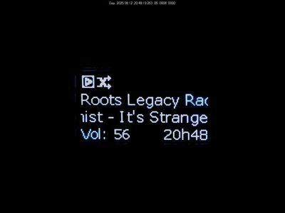

# MoodeOLED

[English](README.md)

MoodeOled est une interface utilisateur sur écran Oled SSD1306/SSD1315 128x64 pour contrôler [Moode Audio](https://moodeaudio.org/) via une télécommande IR ou des boutons GPIO.

<p align="center">
  
</p>

[https://youtu.be/9Y13UeyyT7k?si=hkOkiP9gk0rjxlB8](https://youtu.be/9Y13UeyyT7k?si=hkOkiP9gk0rjxlB8)

---

## ✨ Fonctionnalités

- **NowOLED**: Affiche le morceau en cours, les métadonnées, l'état de lecture, infos matériel etc... Contrôles multimédia, ajout/retrait favoris (suit la playlist configurée dans Moode), modes de lecture, renderers (Bluetooth, Airplay et UPNP) etc, recherche de l'artiste en cours de lecture dans la bibliothèque musicale... Et un petit plus: Log des titres radios (via la touche "favoris") dans un fichier texte pour les lister dans le menu et possibilité de les rechercher via yt-dlp et les réécouter via un stream/radio local (sans téléchargement).
- **NavOLED**: Navigation dans la bibliothèque musicale, recherche, déplacement, copie, suppression vers/depuis stockage local ou usb.
- **QueOLED**: Affiche et gère la file de lecture. Création de playlist.
- **Aide à la configuration et Mappage de télécommande IR**: Configuration LIRC assistée et entièrement personnalisable avec détection de conflits. Possibilité d'ajouter des actions personnalisées aux touches non utilisées dans MoodeOled (voir la fonction handle_custom_key dans media_key_actions.py... *a rendre plus "user friendly") .
- **Support boutons GPIO et encodeur rotatif** en utilisant `rpi_lgpio` . Activez et configurez les broches dans `config.ini` sous la section "manual".
- **Configuration de ZRAM** pour les appareils à faible mémoire (ex: Raspberry Pi Zero 2W).
- Intégration automatique avec le "Ready Script" de Moode pour un démarrage fluide.

---

## 📦 Prérequis système

- **Système d'exploitation** : Moode Audio Player ≥ 9.3.7 requis.

- **Matériel** : Raspberry Pi (Zero 2W, 3, 4, 5 recommandé) + Oled ssd1306/1315 i2c. Et un récepteur IR de type TSOP38 ou similaire (si utilisé).

- **Dépendances APT** (installées automatiquement):
  
  ```bash
  python3-pil python3-venv python3-pip python3-tk
  i2c-tools libgpiod-dev python3-libgpiod python3-lgpio python3-setuptools
  ```

- **Dépendances Python** (installées automatiquement) :
  
  ```txt
  Adafruit_Blinka~=8.55.0
  adafruit_circuitpython_ssd1306~=2.12.21
  Pillow~=11.3.0
  python_mpd2~=3.0.5
  PyYAML~=6.0.2
  Requests~=2.32.4
  rpi_lgpio~=0.6
  yt_dlp~=2025.7.21
  ```

---

## 🚀 Installation

1. Cloner ce dépôt :
   
   ```bash
   sudo apt update && sudo apt install git
   git clone https://github.com/Trachou2Bois/MoodeOled.git
   ```

2. Lancer le script d'installation :
   
   ```bash
   python3 ~/MoodeOled/install/setup.py
   ```
   
   - Détecte la version de Moode.
   - Installe les dépendances APT et Python.
   - Configure l'I²C si désactivé.
   - Crée un environnement virtuel (`~/.moodeoled-venv` par défaut).
   - Propose la configuration de ZRAM si <1 Go de RAM détecté.
   - Installe les services systemd.
   - Propose l'installation de LIRC

3. Suivez les instructions affichées à l'écran.

---

## 🖥 Services

Les services systemd suivants sont créés lors de l'installation :

| Service      | Description                        |
| ------------ | ---------------------------------- |
| `nowoled`    | Affiche l'écran "Lecture en cours" |
| `navoled`    | Navigation dans la bibliothèque    |
| `queoled`    | Affichage de la file de lecture    |
| `pioled-off` | Éteint l'écran OLED à l'arrêt      |

On switch entre les 3 principaux script d'affichage via la touche KEY_BACK

---

## 🎛 Configuration de la télécommande IR

MoodeOLED inclut un script interactif pour configurer LIRC :

```bash
python3 ~/MoodeOLED/install/install_lirc_remote.py
```

Fonctionnalités :

-Installation et configuration de LIRC.
- Test matériel (mode2, irw).
- Télécharger une configuration depuis `irdb-get`.
- Apprentissage d'une télécommande (`irrecord`).
- **Éditeur de mappage** :
  - Réassigner toutes les touches ou individuellement.
  - Détection des conflits (confirmation si une touche est déjà mappée).
  - Avertissement si mappage d'une touche système (ex: `KEY_UP`).

Les mappages sont stockés dans `config.ini` :

```ini
[remote_mapping]
#KEY_MOODEOLED = YOUR_REMOTE_KEY
# Touches requises
KEY_PLAY = KEY_PLAYPAUSE
KEY_BACK = KEY_ESC
...
# Touches optionnelles
KEY_FORWARD = KEY_FASTFORWARD
KEY_NEXT = KEY_NEXTSONG
```

---

## ⌨ Support GPIO et encodeur

MoodeOLED utilise `rpi_lgpio`, vous pouvez configurer les boutons GPIO ou un encodeur rotatif dans `config.ini`. Vous pouvez utiliser `gpioinfo` pour vérifier vos broches libres.

Exemple :

```ini
[manual]
use_gpio = true
use_rotary = true

[buttons]
KEY_PLAY = 17
KEY_STOP = 27

[rotary]
pin_a = 22
pin_b = 23
pin_btn = 24
```

---

## **🎛 Configuration des touches**

### 🔑 Touches indispensables

Ces touches sont **requises** pour naviguer et contrôler toutes les interfaces :

| Touche              | Rôle générique                                        | Usage spécifique dans `nowoled`                            |
| ------------------- | ----------------------------------------------------- | ---------------------------------------------------------- |
| **KEY_UP**          | Déplacement vers le haut                              | Volume + si hors menu                                      |
| **KEY_DOWN**        | Déplacement vers le bas                               | Volume - si hors menu                                      |
| **KEY_LEFT**        | Déplacement gauche                                    | Précédent / Seek -10s (long press) si hors menu            |
| **KEY_RIGHT**       | Déplacement droite                                    | Suivant / Seek +10s (long press) si hors menu              |
| **KEY_OK**          | Ouvre menu / menu Outils (long press) / Validation    | idem                                                       |
| **KEY_BACK**        | Basculer vers `navoled`/ `queoled`/`nowoled`          | Basculer vers `navoled` (court) / `queoled` (long)         |
| **KEY_INFO**        | Afficher l’aide contextuelle                          | Idem                                                       |
| **KEY_CHANNELUP**   | Action contextuelle                                   | Ajouter/Retirer des favoris,  Si radio: ajouter au songlog |
| **KEY_CHANNELDOWN** | Action contextuelle                                   | Retirer de la file de lecture                              |
| **KEY_PLAY**        | Si hors menu: Lecture/pause / Extinction (long press) | Si hors menu: Lecture/pause / Extinction (long press)      |

Ces touches sont à configurer soit via LIRC (`python3 ~/MoodeOLED/install/install_lirc_remote.py`), soit via GPIO (section `[buttons]` du `config.ini`).

### 🎵 Touches multimédia (optionnelles)

Recommandées si disponibles sur votre télécommande, mais **non obligatoires** :

| Touche             | Action                             |
| ------------------ | ---------------------------------- |
| **KEY_STOP**       | Arrêt de la lecture                |
| **KEY_NEXT**       | Suivant / Seek +10s (long press)   |
| **KEY_PREVIOUS**   | Précédent / Seek -10s (long press) |
| **KEY_FORWARD**    | Seek +10s                          |
| **KEY_REWIND**     | Seek -10s                          |
| **KEY_VOLUMEUP**   | Volume +                           |
| **KEY_VOLUMEDOWN** | Volume -                           |
| **KEY_MUTE**       | Mute                               |
| **KEY_POWER**      | Redémarrer / éteindre (long press) |

> **Remarque :** Dans `nowoled`, les touches de navigation (`UP`, `DOWN`, `LEFT`, `RIGHT`) peuvent remplacer les touches multimédia optionnelles si elles ne sont pas présentes.

---

## 🔧 Configuration via menu outil dans nowoled:

Un petit menu de configuration est disponible via l'écran pour modifier:

- La durée avant mise en veille de l'écran

- Qualité du flux de stream local (favoris radio)

- La langue (actuellement Anglais et Français)

- Activer/désactiver mode debug

---

## 🧠 ZRAM sur les appareils à faible mémoire

Si le Raspberry Pi a moins de **1 Go de RAM** (ex: Zero 2W) :

- L'installateur propose d'installer `zram-tools` et de configurer ZRAM (280 Mo, lz4).
- Désactive totalement le swap.

---

## ⚠️ Rappel configuration Moode

Dans **Moode > System Config** :

- Activez **Ready Script** (Système).
- Activez **LCD Updater** (Périphériques).

---

## 🤝 Contribuer

Les contributions et suggestions de fonctionnalités sont les bienvenues !  
Améliorations futures possibles :

- Support d'écrans supplémentaires.
- Traduction dans d'autres langues
- Amélioration de la doc

---

## 📄 Licence

Licence et attribution

Ce projet est sous licence GNU General Public License v3.0 (GPLv3).
Consultez le fichier [LICENSE](./LICENSE) pour plus de détails.

Ce projet s'appuie sur Moode Audio Player et peut réutiliser des modèles de code et des approches de configuration différents.
Moode est sous licence GPLv3 : https://moodeaudio.org/LICENSE.txt

## **Avertissement**

Ce projet n'est ni affilié ni approuvé par l'équipe officielle de Moode Audio.

Le logiciel et les autres éléments de ce dépôt sont distribués sous la [LICENCE PUBLIQUE GÉNÉRALE GNU Version 3](https://github.com/Trachou2Bois/MoodeOled/blob/main/LICENSE) qui inclut l'avertissement suivant :

> 15. Exclusion de garantie.
> 
> IL N'EXISTE AUCUNE GARANTIE POUR LE PROGRAMME, DANS LA MESURE PERMISE PAR LA LOI APPLICABLE. SAUF MENTION CONTRAIRE ÉCRITE, LES TITULAIRES DES DROITS D'AUTEUR ET/OU LES AUTRES PARTIES FOURNISSENT LE PROGRAMME « EN L'ÉTAT » SANS AUCUNE GARANTIE, EXPLICITE OU IMPLICITE, Y COMPRIS, MAIS SANS S'Y LIMITER, LES GARANTIES IMPLICITES DE QUALITÉ MARCHANDE ET D'ADÉQUATION À UN USAGE PARTICULIER. VOUS ASSUMEZ L'INTÉGRALITÉ DES RISQUES LIÉS À LA QUALITÉ ET AUX PERFORMANCES DU PROGRAMME. EN CAS DE DÉFAUT DU PROGRAMME, VOUS ASSUMEZ LES FRAIS DE TOUS LES ENTRETIENS, RÉPARATIONS OU CORRECTIONS NÉCESSAIRES.
> 
> 16. Limitation de responsabilité. >
>     EN AUCUN CAS, SAUF EXIGENCE PAR LA LOI APPLICABLE OU ACCORD ÉCRIT, LE TITULAIRE DES DROITS D'AUTEUR OU TOUTE AUTRE PARTIE MODIFIANT ET/OU TRANSMETTANT LE PROGRAMME COMME AUTORISÉ CI-DESSUS, NE POURRA ÊTRE TENU RESPONSABLE ENVERS VOUS DE TOUS DOMMAGES, Y COMPRIS TOUS DOMMAGES GÉNÉRAUX, SPÉCIAUX, ACCESSOIRES OU CONSÉCUTIFS, DÉCOULANT DE L'UTILISATION OU DE L'INCAPACITÉ D'UTILISER LE PROGRAMME (Y COMPRIS, MAIS SANS S'Y LIMITER, LA PERTE DE DONNÉES, L'INEXACTITUDE DE DONNÉES, LES PERTES SUBIES PAR VOUS OU DES TIERS, OU L'INCAPACITÉ DU PROGRAMME À FONCTIONNER AVEC D'AUTRES PROGRAMMES), MÊME SI CE TITULAIRE OU CETTE AUTRE PARTIE A ÉTÉ AVISÉ DE LA POSSIBILITÉ DE TELS DOMMAGES.

Cela signifie que l'utilisateur de ce logiciel est responsable de tout dommage résultant de son utilisation. Peu importe que le dommage soit causé par une mauvaise utilisation ou par un bug dans le logiciel.
